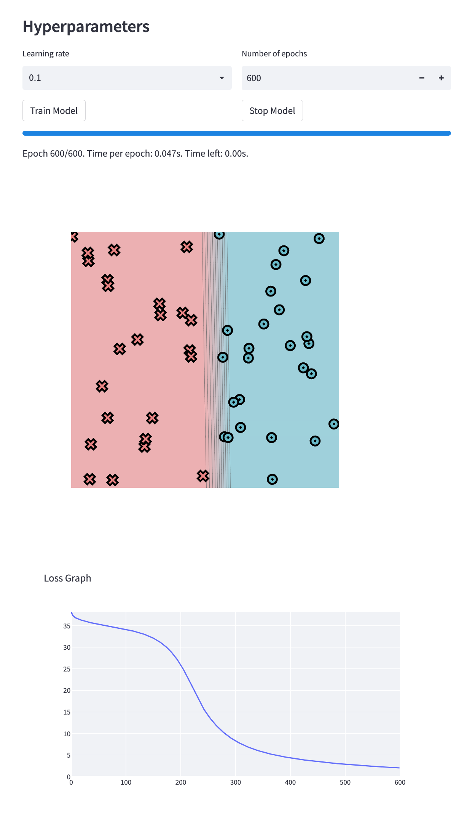
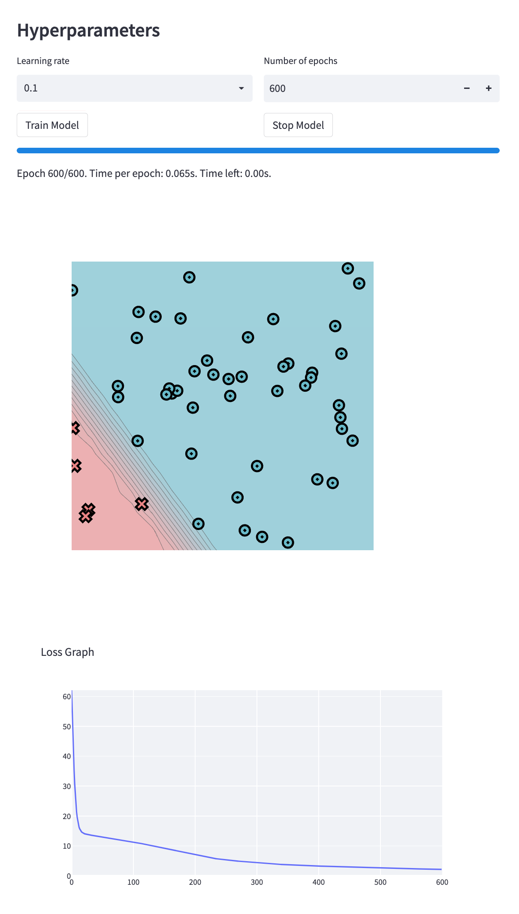
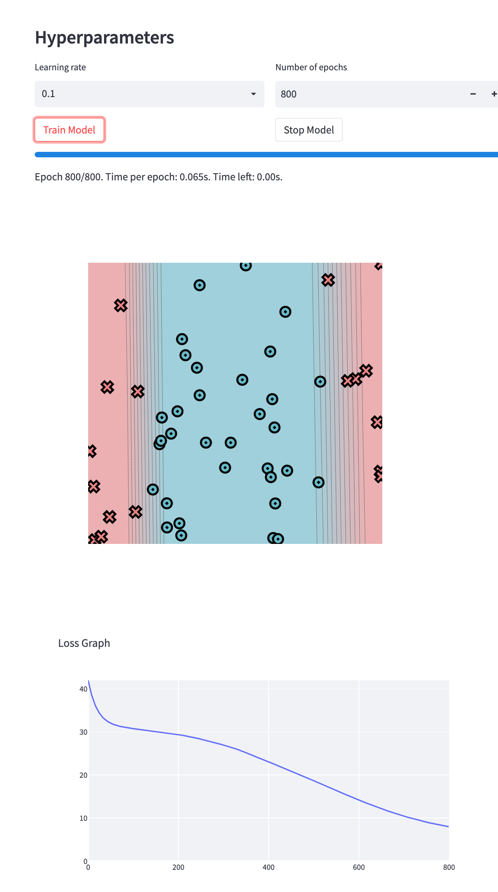
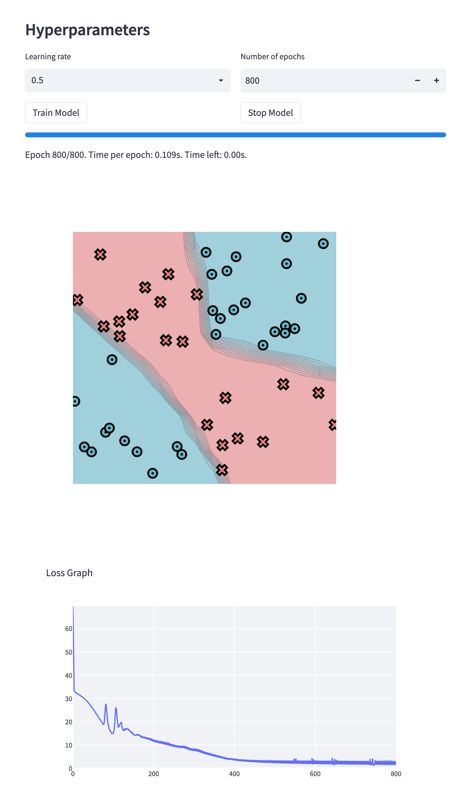

[](https://classroom.github.com/a/7COonC5j)
# MiniTorch Module 1


* Docs: https://minitorch.github.io/

* Overview: https://minitorch.github.io/module1/module1/

This assignment requires the following files from the previous assignments. You can get these by running

```bash
python sync_previous_module.py previous-module-dir current-module-dir
```

The files that will be synced are:

        minitorch/operators.py minitorch/module.py tests/test_module.py tests/test_operators.py project/run_manual.py

# Task 5: Training

## Simple:
Time per epoch: 0.046s
### Parameters:
    PTS = 50
    HIDDEN = 3
    RATE = 0.1
    EPOCHS = 600
### Visualization:

### Records:
        Epoch: 10/600, loss: 34.42562527854912, correct: 27
        Epoch: 20/600, loss: 34.18072805832301, correct: 27
        Epoch: 30/600, loss: 33.981961621046686, correct: 27
        Epoch: 40/600, loss: 33.76849786201834, correct: 27
        Epoch: 50/600, loss: 33.502163005690115, correct: 27
        Epoch: 60/600, loss: 33.15186446696406, correct: 27
        Epoch: 70/600, loss: 32.68266950824513, correct: 28
        Epoch: 80/600, loss: 32.05127273190951, correct: 32
        Epoch: 90/600, loss: 31.20413907058144, correct: 33
        Epoch: 100/600, loss: 30.102831089084454, correct: 38
        Epoch: 110/600, loss: 28.727564731663325, correct: 44
        Epoch: 120/600, loss: 27.060159657482583, correct: 46
        Epoch: 130/600, loss: 25.110021305841276, correct: 47
        Epoch: 140/600, loss: 22.930194828670174, correct: 46
        Epoch: 150/600, loss: 20.656990465605897, correct: 47
        Epoch: 160/600, loss: 18.43867298991167, correct: 47
        Epoch: 170/600, loss: 16.42566929309574, correct: 47
        Epoch: 180/600, loss: 14.692833893963767, correct: 47
        Epoch: 190/600, loss: 13.229192553373892, correct: 47
        Epoch: 200/600, loss: 12.003996978863615, correct: 47
        Epoch: 210/600, loss: 10.978361350217062, correct: 47
        Epoch: 220/600, loss: 10.118376851846744, correct: 47
        Epoch: 230/600, loss: 9.387857577129623, correct: 47
        Epoch: 240/600, loss: 8.756009486091415, correct: 47
        Epoch: 250/600, loss: 8.2041285025533, correct: 47
        Epoch: 260/600, loss: 7.718705054998373, correct: 48
        Epoch: 270/600, loss: 7.288297734806072, correct: 48
        Epoch: 280/600, loss: 6.904682251980397, correct: 48
        Epoch: 290/600, loss: 6.56106962389607, correct: 48
        Epoch: 300/600, loss: 6.252192668644535, correct: 48
        Epoch: 310/600, loss: 5.974863906338865, correct: 48
        Epoch: 320/600, loss: 5.723497491684672, correct: 48
        Epoch: 330/600, loss: 5.4953706608966435, correct: 48
        Epoch: 340/600, loss: 5.287034795363265, correct: 48
        Epoch: 350/600, loss: 5.095831141687547, correct: 48
        Epoch: 360/600, loss: 4.920417201619715, correct: 48
        Epoch: 370/600, loss: 4.758686182555173, correct: 48
        Epoch: 380/600, loss: 4.6087416979673215, correct: 48
        Epoch: 390/600, loss: 4.469317235671383, correct: 48
        Epoch: 400/600, loss: 4.3393022828945975, correct: 48
        Epoch: 410/600, loss: 4.217722726993959, correct: 49
        Epoch: 420/600, loss: 4.103731982234275, correct: 50
        Epoch: 430/600, loss: 3.9966190952701544, correct: 50
        Epoch: 440/600, loss: 3.8957331915795725, correct: 50
        Epoch: 450/600, loss: 3.8004479725216513, correct: 50
        Epoch: 460/600, loss: 3.7102020481371896, correct: 50
        Epoch: 470/600, loss: 3.624554427983889, correct: 50
        Epoch: 480/600, loss: 3.5430955638665793, correct: 50
        Epoch: 490/600, loss: 3.46551146616957, correct: 50
        Epoch: 500/600, loss: 3.3917155657783202, correct: 50
        Epoch: 510/600, loss: 3.3211181121243007, correct: 50
        Epoch: 520/600, loss: 3.2534679733830294, correct: 50
        Epoch: 530/600, loss: 3.1885430974784534, correct: 50
        Epoch: 540/600, loss: 3.126193841134876, correct: 50
        Epoch: 550/600, loss: 3.0662122968249657, correct: 50
        Epoch: 560/600, loss: 3.0084086094858167, correct: 50
        Epoch: 570/600, loss: 2.952644811728067, correct: 50
        Epoch: 580/600, loss: 2.8988082280364833, correct: 50
        Epoch: 590/600, loss: 2.8467556090044144, correct: 50
        Epoch: 600/600, loss: 2.7963803764152675, correct: 50

## Diag
Time per epoch: 0.062s.
### Parameters"
    PTS = 50
    HIDDEN = 4
    RATE = 0.1
    Epochs = 600
### Visualizations

### Records
        Epoch: 10/600, loss: 22.984917349985473, correct: 44
        Epoch: 20/600, loss: 17.671634291074025, correct: 44
        Epoch: 30/600, loss: 15.093930395187439, correct: 44
        Epoch: 40/600, loss: 13.649533850127902, correct: 44
        Epoch: 50/600, loss: 12.621040425748973, correct: 44
        Epoch: 60/600, loss: 11.800359141555665, correct: 44
        Epoch: 70/600, loss: 11.076577204463792, correct: 44
        Epoch: 80/600, loss: 10.380454636041577, correct: 44
        Epoch: 90/600, loss: 9.704979529068945, correct: 44
        Epoch: 100/600, loss: 9.06792509940408, correct: 44
        Epoch: 110/600, loss: 8.475386626041223, correct: 44
        Epoch: 120/600, loss: 7.923430304044961, correct: 46
        Epoch: 130/600, loss: 7.406462738988905, correct: 47
        Epoch: 140/600, loss: 6.926323071142839, correct: 47
        Epoch: 150/600, loss: 6.48842118143805, correct: 47
        Epoch: 160/600, loss: 6.086637981872376, correct: 48
        Epoch: 170/600, loss: 5.719348312223952, correct: 48
        Epoch: 180/600, loss: 5.383410357227923, correct: 48
        Epoch: 190/600, loss: 5.0762986458729875, correct: 48
        Epoch: 200/600, loss: 4.795459929685195, correct: 48
        Epoch: 210/600, loss: 4.538482524230451, correct: 48
        Epoch: 220/600, loss: 4.303439801601202, correct: 50
        Epoch: 230/600, loss: 4.088016571237788, correct: 50
        Epoch: 240/600, loss: 3.8905883511537542, correct: 50
        Epoch: 250/600, loss: 3.709162325629443, correct: 50
        Epoch: 260/600, loss: 3.5415008310949205, correct: 50
        Epoch: 270/600, loss: 3.3861239403586345, correct: 50
        Epoch: 280/600, loss: 3.241888531915492, correct: 50
        Epoch: 290/600, loss: 3.1080145802098462, correct: 50
        Epoch: 300/600, loss: 2.983172770137176, correct: 50
        Epoch: 310/600, loss: 2.8666967917782253, correct: 50
        Epoch: 320/600, loss: 2.7574369915516277, correct: 50
        Epoch: 330/600, loss: 2.6548950402445377, correct: 50
        Epoch: 340/600, loss: 2.5589621277659793, correct: 50
        Epoch: 350/600, loss: 2.4686988042215923, correct: 50
        Epoch: 360/600, loss: 2.3838741816741433, correct: 50
        Epoch: 370/600, loss: 2.304090781047134, correct: 50
        Epoch: 380/600, loss: 2.2286537969290445, correct: 50
        Epoch: 390/600, loss: 2.1574182380894866, correct: 50
        Epoch: 400/600, loss: 2.089954475482958, correct: 50
        Epoch: 410/600, loss: 2.025931542184712, correct: 50
        Epoch: 420/600, loss: 1.9650775261203417, correct: 50
        Epoch: 430/600, loss: 1.907154493739854, correct: 50
        Epoch: 440/600, loss: 1.8519467290479443, correct: 50
        Epoch: 450/600, loss: 1.7992634328919916, correct: 50
        Epoch: 460/600, loss: 1.748932731731384, correct: 50
        Epoch: 470/600, loss: 1.700799271805684, correct: 50
        Epoch: 480/600, loss: 1.6547221720450516, correct: 50
        Epoch: 490/600, loss: 1.6105732766311331, correct: 50
        Epoch: 500/600, loss: 1.5682356584488666, correct: 50
        Epoch: 510/600, loss: 1.528324043400612, correct: 50
        Epoch: 520/600, loss: 1.4905141109225624, correct: 50
        Epoch: 530/600, loss: 1.4540771403085282, correct: 50
        Epoch: 540/600, loss: 1.418944808957419, correct: 50
        Epoch: 550/600, loss: 1.3850539235170434, correct: 50
        Epoch: 560/600, loss: 1.3523457684664677, correct: 50
        Epoch: 570/600, loss: 1.3207653067431018, correct: 50
        Epoch: 580/600, loss: 1.2902608760683119, correct: 50
        Epoch: 590/600, loss: 1.2607844010666944, correct: 50
        Epoch: 600/600, loss: 1.2323967630084736, correct: 50

## Split
Time per epoch: 0.064s.
### Parameters
    PTS = 50
    HIDDEN = 4
    LEARNING RATE = 0.1
    EPOCHS = 800
### Visualizations:

### Records:
        Epoch: 10/800, loss: 36.388350720566095, correct: 20
        Epoch: 20/800, loss: 33.77225064280194, correct: 28
        Epoch: 30/800, loss: 33.130948748678996, correct: 30
        Epoch: 40/800, loss: 32.88937190761125, correct: 30
        Epoch: 50/800, loss: 32.69124588018471, correct: 30
        Epoch: 60/800, loss: 32.4504391585277, correct: 30
        Epoch: 70/800, loss: 32.24115658853324, correct: 30
        Epoch: 80/800, loss: 32.07954084431713, correct: 30
        Epoch: 90/800, loss: 31.960581137749944, correct: 34
        Epoch: 100/800, loss: 31.85112609745491, correct: 33
        Epoch: 110/800, loss: 31.754531573283476, correct: 32
        Epoch: 120/800, loss: 31.656925409957058, correct: 31
        Epoch: 130/800, loss: 31.556693061696983, correct: 32
        Epoch: 140/800, loss: 31.437131354178597, correct: 32
        Epoch: 150/800, loss: 31.31397580775879, correct: 32
        Epoch: 160/800, loss: 31.16285435643972, correct: 32
        Epoch: 170/800, loss: 31.00524453628384, correct: 32
        Epoch: 180/800, loss: 30.869940829992984, correct: 33
        Epoch: 190/800, loss: 30.73546891613903, correct: 34
        Epoch: 200/800, loss: 30.593169360754764, correct: 34
        Epoch: 210/800, loss: 30.442032279000692, correct: 34
        Epoch: 220/800, loss: 30.281049006879595, correct: 35
        Epoch: 230/800, loss: 30.109304105345725, correct: 35
        Epoch: 240/800, loss: 29.92629052302151, correct: 35
        Epoch: 250/800, loss: 29.73279488570359, correct: 35
        Epoch: 260/800, loss: 29.52683789932834, correct: 35
        Epoch: 270/800, loss: 29.30927399463243, correct: 35
        Epoch: 280/800, loss: 29.076777585653534, correct: 35
        Epoch: 290/800, loss: 28.827491267206184, correct: 35
        Epoch: 300/800, loss: 28.559501463305786, correct: 35
        Epoch: 310/800, loss: 28.272893737049333, correct: 35
        Epoch: 320/800, loss: 27.96667454176901, correct: 36
        Epoch: 330/800, loss: 27.639272975083344, correct: 36
        Epoch: 340/800, loss: 27.288693076096333, correct: 36
        Epoch: 350/800, loss: 26.91223052305799, correct: 37
        Epoch: 360/800, loss: 26.507548082376385, correct: 37
        Epoch: 370/800, loss: 26.072518143813795, correct: 37
        Epoch: 380/800, loss: 25.605252865871766, correct: 37
        Epoch: 390/800, loss: 25.105239891705, correct: 38
        Epoch: 400/800, loss: 24.569680308421237, correct: 38
        Epoch: 410/800, loss: 23.99641671592567, correct: 38
        Epoch: 420/800, loss: 23.38512870342713, correct: 39
        Epoch: 430/800, loss: 22.73527837584913, correct: 39
        Epoch: 440/800, loss: 22.047179181007003, correct: 42
        Epoch: 450/800, loss: 21.32249264733557, correct: 43
        Epoch: 460/800, loss: 20.564213144666372, correct: 44
        Epoch: 470/800, loss: 19.77633202640212, correct: 44
        Epoch: 480/800, loss: 18.964242123703247, correct: 45
        Epoch: 490/800, loss: 18.14136620132071, correct: 45
        Epoch: 500/800, loss: 17.334190267891184, correct: 49
        Epoch: 510/800, loss: 16.531432973031, correct: 49
        Epoch: 520/800, loss: 15.738240890104828, correct: 49
        Epoch: 530/800, loss: 14.960861424785476, correct: 49
        Epoch: 540/800, loss: 14.204611406228034, correct: 49
        Epoch: 550/800, loss: 13.474121554902903, correct: 49
        Epoch: 560/800, loss: 12.787736084562153, correct: 49
        Epoch: 570/800, loss: 12.157927559596907, correct: 49
        Epoch: 580/800, loss: 11.559876682079478, correct: 49
        Epoch: 590/800, loss: 10.99204547073115, correct: 49
        Epoch: 600/800, loss: 10.454949082533107, correct: 49
        Epoch: 610/800, loss: 9.957037758503953, correct: 49
        Epoch: 620/800, loss: 9.491873967760373, correct: 49
        Epoch: 630/800, loss: 9.061674886238983, correct: 50
        Epoch: 640/800, loss: 8.658224221346293, correct: 50
        Epoch: 650/800, loss: 8.283651382592764, correct: 50
        Epoch: 660/800, loss: 7.945679107310919, correct: 50
        Epoch: 670/800, loss: 7.634383087049811, correct: 50
        Epoch: 680/800, loss: 7.328594902635565, correct: 50
        Epoch: 690/800, loss: 7.034387106242517, correct: 50
        Epoch: 700/800, loss: 6.753748531348249, correct: 50
        Epoch: 710/800, loss: 6.492649012845344, correct: 50
        Epoch: 720/800, loss: 6.246733908257805, correct: 50
        Epoch: 730/800, loss: 6.014942812725213, correct: 50
        Epoch: 740/800, loss: 5.797098303677152, correct: 50
        Epoch: 750/800, loss: 5.5912880959801745, correct: 50
        Epoch: 760/800, loss: 5.3968512085079405, correct: 50
        Epoch: 770/800, loss: 5.21332018778899, correct: 50
        Epoch: 780/800, loss: 5.034891248180945, correct: 50
        Epoch: 790/800, loss: 4.866231451910975, correct: 50
        Epoch: 800/800, loss: 4.7128947846409135, correct: 50

## XOR
Time per epoch: 0.105s.
### Parameters
    PTS = 50
    HIDDEN = 6
    LEARNING RATE = 0.5
    EPOCHS = 800
### Visualization

### Records
        Epoch: 0/800, loss: 0, correct: 0
        Epoch: 10/800, loss: 31.039656112069387, correct: 33
        Epoch: 20/800, loss: 28.644808606315397, correct: 36
        Epoch: 30/800, loss: 26.489916041735963, correct: 37
        Epoch: 40/800, loss: 24.163991369057666, correct: 40
        Epoch: 50/800, loss: 21.78822678984165, correct: 44
        Epoch: 60/800, loss: 19.411046530298716, correct: 43
        Epoch: 70/800, loss: 17.760791052087725, correct: 44
        Epoch: 80/800, loss: 19.732472757329905, correct: 42
        Epoch: 90/800, loss: 15.858503659920865, correct: 43
        Epoch: 100/800, loss: 18.464087028219225, correct: 44
        Epoch: 110/800, loss: 15.359849053212272, correct: 45
        Epoch: 120/800, loss: 14.690971556998623, correct: 45
        Epoch: 130/800, loss: 15.448087926114358, correct: 43
        Epoch: 140/800, loss: 14.391227769627461, correct: 45
        Epoch: 150/800, loss: 14.285717089524033, correct: 44
        Epoch: 160/800, loss: 13.227480889665882, correct: 45
        Epoch: 170/800, loss: 13.478896532386543, correct: 44
        Epoch: 180/800, loss: 12.563611271527513, correct: 45
        Epoch: 190/800, loss: 12.199277266102516, correct: 45
        Epoch: 200/800, loss: 12.0517541510542, correct: 44
        Epoch: 210/800, loss: 12.369980417950043, correct: 43
        Epoch: 220/800, loss: 11.083681771214277, correct: 44
        Epoch: 230/800, loss: 10.914616128213872, correct: 44
        Epoch: 240/800, loss: 10.514771442989758, correct: 44
        Epoch: 250/800, loss: 10.319703868859271, correct: 45
        Epoch: 260/800, loss: 10.065336751438235, correct: 45
        Epoch: 270/800, loss: 8.88198376361359, correct: 46
        Epoch: 280/800, loss: 9.12540056385836, correct: 46
        Epoch: 290/800, loss: 9.032564046437084, correct: 46
        Epoch: 300/800, loss: 8.794345650525091, correct: 46
        Epoch: 310/800, loss: 7.518659139629134, correct: 48
        Epoch: 320/800, loss: 8.66044961919158, correct: 46
        Epoch: 330/800, loss: 8.512756791696566, correct: 45
        Epoch: 340/800, loss: 6.373786148105321, correct: 48
        Epoch: 350/800, loss: 7.811982148390076, correct: 46
        Epoch: 360/800, loss: 4.7285452554713565, correct: 49
        Epoch: 370/800, loss: 9.12441887403882, correct: 45
        Epoch: 380/800, loss: 4.031451620224781, correct: 49
        Epoch: 390/800, loss: 3.5703018366748935, correct: 50
        Epoch: 400/800, loss: 9.088845392995724, correct: 45
        Epoch: 410/800, loss: 3.2323181283405655, correct: 50
        Epoch: 420/800, loss: 2.6565983788530247, correct: 50
        Epoch: 430/800, loss: 2.4510072077898575, correct: 50
        Epoch: 440/800, loss: 2.8748764354577023, correct: 50
        Epoch: 450/800, loss: 7.741998772164239, correct: 47
        Epoch: 460/800, loss: 2.208339970422803, correct: 50
        Epoch: 470/800, loss: 1.9798382918896589, correct: 50
        Epoch: 480/800, loss: 1.8528103294866884, correct: 50
        Epoch: 490/800, loss: 1.7505736243334165, correct: 50
        Epoch: 500/800, loss: 1.7389158112155259, correct: 50
        Epoch: 510/800, loss: 1.8733022455923365, correct: 50
        Epoch: 520/800, loss: 3.917686593514975, correct: 48
        Epoch: 530/800, loss: 1.6400459659165048, correct: 50
        Epoch: 540/800, loss: 1.4830645241021994, correct: 50
        Epoch: 550/800, loss: 1.4022188470965131, correct: 50
        Epoch: 560/800, loss: 1.3357731420521586, correct: 50
        Epoch: 570/800, loss: 1.2776051271036575, correct: 50
        Epoch: 580/800, loss: 1.225311237691396, correct: 50
        Epoch: 590/800, loss: 1.1773723065043809, correct: 50
        Epoch: 600/800, loss: 1.1331467275038576, correct: 50
        Epoch: 610/800, loss: 1.0926190109511604, correct: 50
        Epoch: 620/800, loss: 1.0565160953234407, correct: 50
        Epoch: 630/800, loss: 1.020038982892824, correct: 50
        Epoch: 640/800, loss: 0.9880856762959497, correct: 50
        Epoch: 650/800, loss: 0.957275851462842, correct: 50
        Epoch: 660/800, loss: 0.928647873671701, correct: 50
        Epoch: 670/800, loss: 0.9017095187031032, correct: 50
        Epoch: 680/800, loss: 0.8762220790926156, correct: 50
        Epoch: 690/800, loss: 0.8521037327065139, correct: 50
        Epoch: 700/800, loss: 0.8290295278431323, correct: 50
        Epoch: 710/800, loss: 0.8074287126878145, correct: 50
        Epoch: 720/800, loss: 0.787819466493579, correct: 50
        Epoch: 730/800, loss: 0.7669414693656584, correct: 50
        Epoch: 740/800, loss: 0.747697110078913, correct: 50
        Epoch: 750/800, loss: 0.7300717377257616, correct: 50
        Epoch: 760/800, loss: 0.7124860852351558, correct: 50
        Epoch: 770/800, loss: 0.6956045878689182, correct: 50
        Epoch: 780/800, loss: 0.6794925637247133, correct: 50
        Epoch: 790/800, loss: 0.6643493176472582, correct: 50
        Epoch: 800/800, loss: 0.6491845498536247, correct: 50